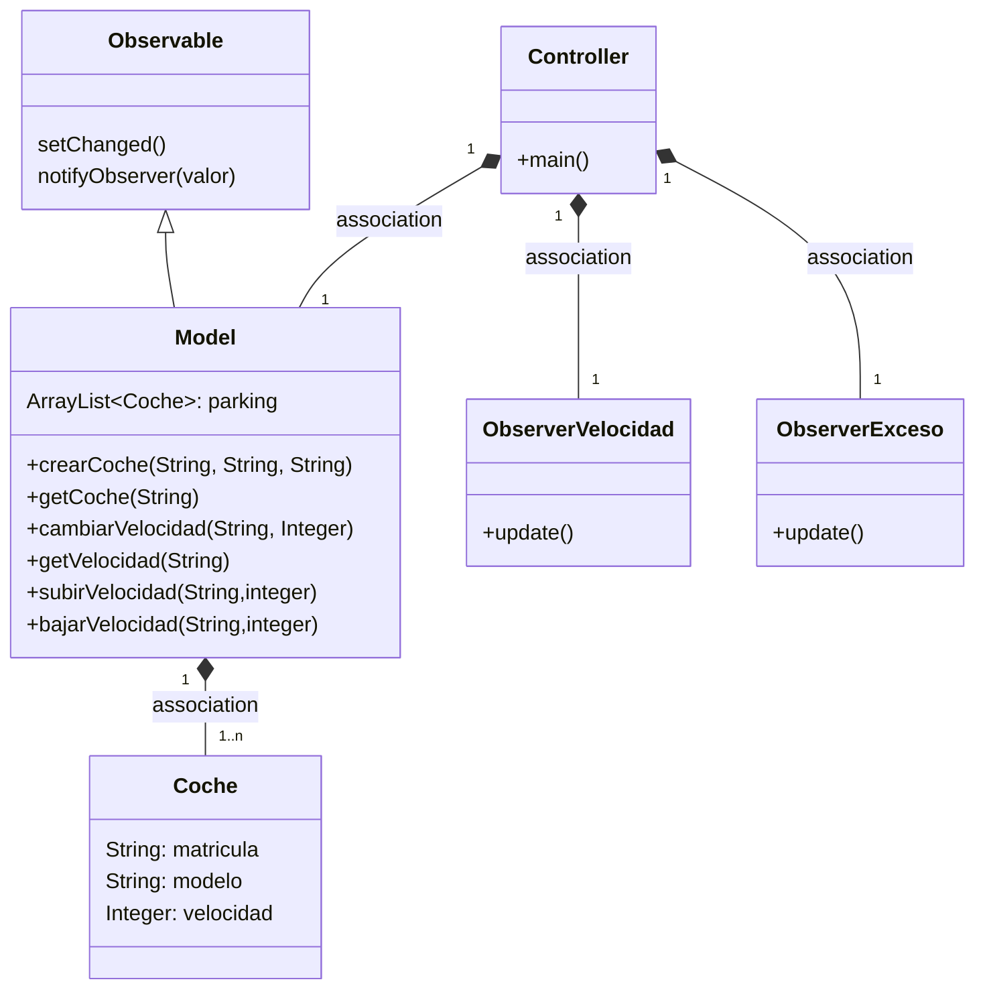
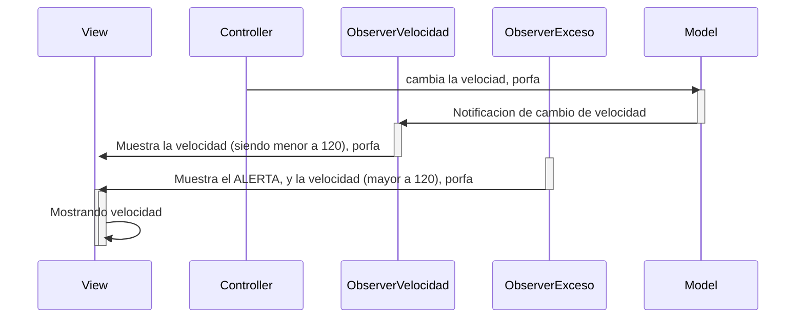

# Arquitectura MVC - Observer (Examen)

Aplicación que trabaja con objetos coches, modifica la velocidad y la muestra.
Adicionalmente, si la velocidad excede de 120km/h muestra un ALERTA.

---
## Explicación:

En la presente rama, añadimos un nuevo **Observer**, el cual tiene la función de advertir al usuario si su velocidad supera los 120km/h.

Para esto añadimos el observer ObsExceso, el cual se diferencia al OVelocidad ya que tiene la condición de actuar sólo si la velocidad del Objeto Coche es mayor a 120 (Esto modifica así el observer OVelocidad el cual tiene la condición de actuar si es una velocidad menor o igual a 120).

Esta condición es trasladada también al método de la clase View, para diferenciar los mensajes y reciclar codigo, usando este mismo método en ambos Observer.

*Espero te haya agradado esta reseña, dale un 10 para apoyar a este humilde programador (más info en el código)* :smile:

---
## Diagrama de clases:

## Diagrama de secuencia:

---
